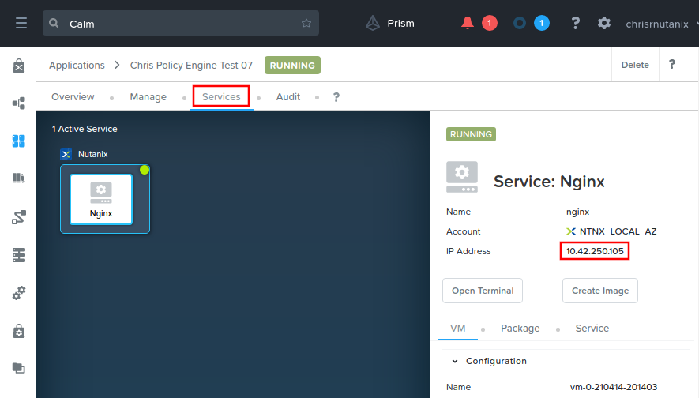

# Nutanix Calm Blueprint - Python Flask App on Docker

This blueprint will create a small demo application that provides the following capabilities:

- Creates a CentOS 8 VM that has been configured with an SSH username, SSH keys, `vim`, `git`
- Installs and configures `firewalld` for app-specific TCP ports
- Installs Python 3.8
- Installs Docker and Docker Compose
- Creates and configures a virtual environment for our Python app
- Launches required Docker containers using the provided `docker-compose.yml` and `Dockerfile` files
- Install dependencies within the container using the Python-standard `requirements.txt` file
- Exposes TCP port 5001 on the container so that users can access the Python Flask app

## Intended Audience

There is assumption that users of this blueprint have previous exposure to the Nutanix Calm UI, in particular:

- Uploading blueprints
- Launching blueprints
- Retrieving launched application information e.g. virtual machine/service IP addresses
- Monitoring of launch progress using the **Audit** tab

## The App

A screenshot of the created app is shown below:


## Requirements

- Prism Central 5.19 or later
- Nutanix Calm 3.0 or later
- Prism Central and Prism Element credentials (read-only credentials are fine)

*Note:* Due to this apps's basic nature, it is assumed your Prism Central and Prism Element environments use identical credentials

## Usage

1. Clone this repo:

   - Either using the terminal:

     ```
     git clone https://github.com/nutanixdev/code-samples
     ```

     **or**:

   - Download a complete copy of this repository using the **Download** button provided by GitHub

2. Login to Prism Central
3. From the "hamburger" or ellipsis menu, select **Services**
4. Open Nutanix Calm
5. Using the **Upload Blueprint** option, upload the `centos8_docker_flask.json` blueprint file from the **blueprints/centos8_docker_flask** directory
6. When prompted, please select an appropriate Calm project for your environment

   *Note:* This setting will be different for all users

7. When prompted, enter **nutanix/4u** as the blueprint password (this will allow the blueprint to import preconfigured SSH credentials)
8. Launch the app using the **Launch** option

   - Defaults have been entered for the location of our Python app; this is simply used to demonstrate Nutanix Calm's ability to accept input from the user and don't need to be changed for this demo
   - **Environment** and **App Profile** shouldn't need to be changed

9.  When the app has finished launching, browse to the VM's IP address on port 5001

    To get the IP address for a Calm managed virtual machine, please see the example screenshot below:

    

*Note:* The app will install CentOS 8 then update all system packages.  Depending on the speed of your internet connection and on how many packages there are to update, this can take some time.

## Creating The App

If you are interested in creating this app from scratch, full and detailed steps have been published in the Nutanix DevOps Marketing lab entitled [Python 3 Flask dashboard](https://www.nutanix.dev/labs/python-flask-dashboard/).

This lab will walk you through creating this from an empty directory, including all dependencies, explanations of the various AJAX calls from JavaScript and Python, as well as the Nutanix Prism Element and Prism Central API requests made by the app.

Please note the lab is designed to create the app for local use vs this repository that runs the same app within a Docker container.

## License

Please see the accompanying `LICENSE` file that is distributed with this repository.

## Disclaimer

Please see the `.disclaimer` file that is distributed with this repository.
